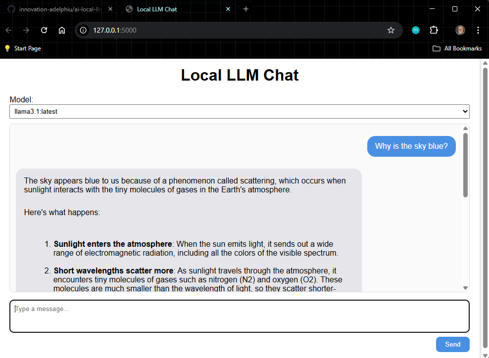

# ai-local-llm-interface

A front-end system for interacting with a locally installed LLM (via Ollama).

Assumes that a local LLM (such as llama3.1) has been installed on your computer via Ollama.

Start the application from the terminal using ```python app.py```; it will start a local server and open a web browser.

